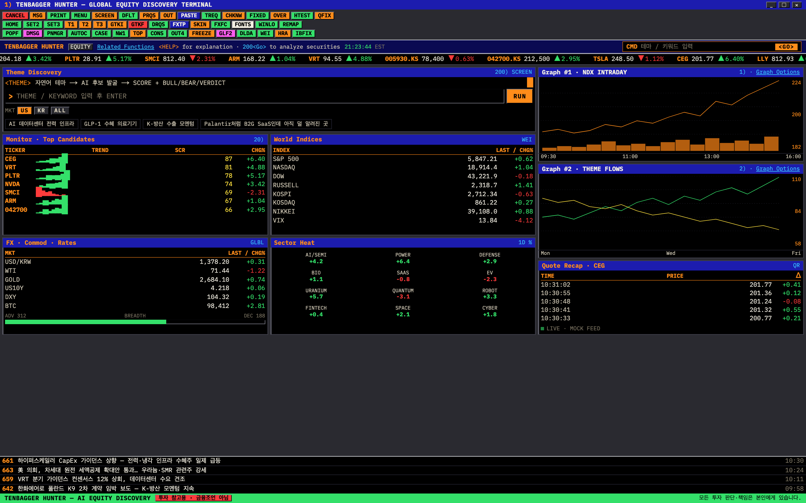
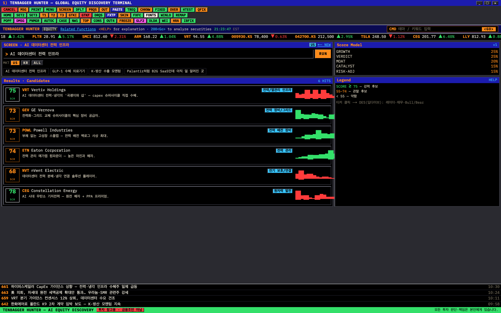
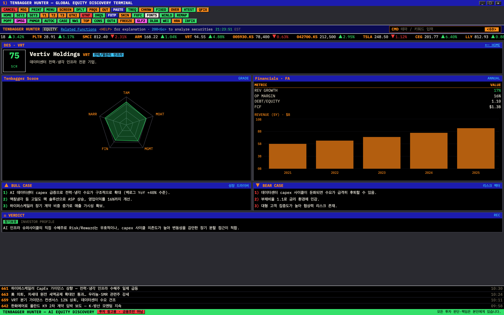

<div align="center">

# 🚀 Tenbagger Hunter

### AI 기반 글로벌 주식 리서치 어시스턴트

**테마 한 줄이면, 10배 오를 기업 후보를 발굴하고 그 이유까지 설명합니다.**

[](./PRD.md)
[](https://nextjs.org/)
[](https://www.typescriptlang.org/)
[](https://www.anthropic.com/)
[](https://supabase.com/)

</div>

---

## 💡 무엇인가요?

Tenbagger Hunter는 단순한 주식 스크리너가 아닙니다.

사용자가 입력한 **자연어 테마**를 AI가 해석해 10배(*ten bagger*) 상승 가능성이 있는 기업 후보를 발굴하고, **왜 그 기업인지**를 내러티브와 데이터로 통합해 설명합니다. 한국과 미국 시장을 함께 다룹니다.

> _"AI 데이터센터 전력 인프라"_ 라고 입력하면 →
> 관련 기업 5~8개 + 각 기업의 Tenbagger Score + Bull/Bear/Verdict 리포트를 받습니다.

---

## 📸 화면

> Bloomberg Terminal 스타일 UI. 아래는 **mock 데이터** 기준이며 `npm run screenshots`로 재생성됩니다.

| 🖥️ 랜딩 | 🔍 탐색 결과 | 📊 딥다이브 |
|---|---|---|
| [](docs/screenshots/landing.png) | [](docs/screenshots/search.png) | [](docs/screenshots/deepdive.png) |
| 자연어 테마 입력 + 추천 칩 | Tenbagger Score 카드 5~8개 | 5축 레이더 · 재무 · Bull/Bear/Verdict |

---

## ✨ 기존 스크리너와 무엇이 다른가요?

| 기존 스크리너 (Finviz, HTS) | **Tenbagger Hunter** |
|---|---|
| 🔢 숫자 필터링 | 💬 자연어 테마 탐색 |
| 📋 결과 나열 | 📖 Bull / Bear / Verdict 스토리텔링 |
| 🧊 정적 데이터 | ⚡ 최신 뉴스 + 재무 동적 반영 |
| 🇺🇸 또는 🇰🇷 단일 시장 | 🌏 글로벌 통합 (한국 + 미국) |

---

## 🎯 핵심 기능

### 🔍 F-01. 테마 기반 탐색 `P0`
자연어로 테마를 입력하거나 추천 칩을 클릭하면, AI가 테마를 해석해 관련 기업 5~8개를 도출합니다. 한국주 / 미국주 / 전체 필터 지원.

```
"GLP-1 수혜 의료기기"
"K-방산 수출 모멘텀"
"Palantir처럼 B2G SaaS인데 아직 덜 알려진 곳"
```

### 📊 F-02. Tenbagger Score 카드 `P0`
기업당 **5개 축**으로 0~100점을 산출해 시각화합니다.

| 축 | 설명 | 가중치 |
|---|---|:---:|
| TAM 침투율 | 현재 시총 / 추정 TAM | 25% |
| 해자 강도 | 경쟁 우위 지속성 | 20% |
| 경영진 신뢰 | 오너십, 트랙레코드 | 15% |
| 재무 건전성 | FCF, 부채비율, 성장률 | 25% |
| 내러티브 강도 | 시장이 아직 모르는 스토리 | 15% |

> 정량 지표는 FMP/DART 데이터로 계산하고, 정성 지표는 Claude API가 평가합니다.

### ⚖️ F-03. Bull / Bear / Verdict `P0`
기업별 AI 분석 리포트 — 🟢 강세 논거 3가지, 🔴 약세 리스크 3가지, 그리고 현재 Risk/Reward에 기반한 최종 판단(장기보유 / 모멘텀 / 관망)을 제시합니다.

<details>
<summary><b>📈 고도화 기능 더 보기 (P1 / P2)</b></summary>

- **F-04. 기업 딥다이브** — 5년 재무 차트, 최신 뉴스 요약, 동종업계 비교, 리스크 팩터
- **F-05. Watchlist & 히스토리** — 기업 저장, Score 변화 타임라인, 투자 thesis 메모
- **F-06. 비교 모드** — 같은 테마 내 2개 기업 나란히 비교 + 지표별 승/패 하이라이트
- **F-07. 데일리 픽 피드** — AI가 매일 1개 기업 발굴 + 푸시 알림
- **F-08. 소셜 공유 카드** — "오늘 발견한 Tenbagger 후보" 이미지 자동 생성

</details>

---

## 🛠️ 기술 스택

<table>
<tr>
<td><b>Frontend</b></td>
<td>Next.js 14 (App Router) · TypeScript · Tailwind CSS + shadcn/ui · Recharts</td>
</tr>
<tr>
<td><b>Backend</b></td>
<td>Next.js API Routes <i>(트래픽 증가 시 FastAPI 분리 검토)</i></td>
</tr>
<tr>
<td><b>AI</b></td>
<td>Claude API (claude-sonnet-4) — 테마 탐색 · Score 평가 · 리포트 생성 · 뉴스 요약(web_search)</td>
</tr>
<tr>
<td><b>Database</b></td>
<td>Supabase (PostgreSQL) — 재무 데이터 캐싱 · Watchlist · Score 이력</td>
</tr>
<tr>
<td><b>Infra</b></td>
<td>Vercel <i>(배포 시 Railway / Fly.io 검토)</i></td>
</tr>
</table>

### 데이터 소스

| 시장 | 재무 / 공시 | 주가 | 뉴스 |
|---|---|---|---|
| 🇺🇸 미국 | FMP · SEC EDGAR | FMP | Claude web_search |
| 🇰🇷 한국 | DART Open API | KRX | Claude web_search |

---

## 🗺️ 화면 흐름

```
[랜딩]  ──테마 입력 / 추천 칩──▶  [탐색 결과]  ──기업 카드 클릭──▶  [딥다이브]
                                  기업 카드 5~8개                   레이더 차트
                                  한국/미국 필터                    Bull/Bear/Verdict
                                                                    재무 차트 + 뉴스
                                                                    Watchlist 저장
                                                                         │
                                                                         ▼
                                                                   [Watchlist]
                                                                   Score 변화 + 메모
```

---

## 📅 개발 로드맵

| Phase | 목표 | 기간 |
|:---:|---|:---:|
| **1** | MVP (미국주) — scaffold, FMP wrapper, 테마 탐색, Score v1, Bull/Bear UI | `2주` |
| **2** | 한국주 추가 — DART/KRX 연동, Adapter 패턴 통일, Watchlist DB | `+1주` |
| **3** | 고도화 — 재무 차트, 뉴스 통합, 비교 모드, UI 디자인 | `+1주` |
| **4** | 배포 준비 — 소셜 카드, 데일리 픽, 인증, 모니터링 | `필요시` |

> 상세 작업 목록은 [PRD.md](./PRD.md#7-개발-로드맵) 참고

---

## 🚦 시작하기

> ✅ Phase 1 (미국주 MVP) 구현 완료 — **키 없이 mock 모드로 바로 실행**됩니다.

```bash
git clone https://github.com/boostcampwm-snu-2026-1/TenbaggerHunter-KwanghoKim.git
cd TenbaggerHunter-KwanghoKim
npm install

# mock 모드로 바로 실행 (외부 키 불필요)
npm run dev          # → http://localhost:3000

# 실 데이터로 쓰려면 .env.local 생성 후 키 입력:
#   AI_PROVIDER=cli|api   # cli=Claude Code 구독 / api=Anthropic 키
#   FMP_API_KEY=...       # 미국 재무 (무료 티어 250 req/day)
```

> AI provider는 `mock`(기본) · `cli`(Claude 구독) · `api`(Anthropic 키) 3가지를 `AI_PROVIDER`로 전환합니다.

---

## 🧭 프로젝트 관리

이 프로젝트는 **Agent(Claude Code) 기반 워크플로우**를 지속적으로 발전시키며, 3주 이후에도 유지 가능한 구조를 목표로 합니다.

### 브랜치 전략
```
main      ← 안정 버전 (직접 push 금지, dev에서만 머지)
 └─ dev   ← 통합 브랜치
     └─ feature/*   ← 기능 단위 작업 → dev로 PR
```

### 운영 규칙
| 항목 | 방식 |
|---|---|
| **Task 관리** | [GitHub Issues](https://github.com/boostcampwm-snu-2026-1/TenbaggerHunter-KwanghoKim/issues) — 기능 단위로 등록 |
| **문서/기획** | [GitHub Wiki](https://github.com/boostcampwm-snu-2026-1/TenbaggerHunter-KwanghoKim/wiki) — 기획서·워크플로우 |
| **PR 단위** | `feature/*` → `dev` (컴포넌트 단위 PR) |
| **커밋** | Conventional Commits (`feat`/`fix`/`refactor`/`docs`/`chore`/`prompt`) |
| **AI 컨텍스트** | [CLAUDE.md](./CLAUDE.md) 매 세션 갱신 |

---

## 📚 문서

- 📄 [Product Requirements Document (PRD)](./PRD.md) — 전체 제품 명세
- 🤖 [AI 개발 워크플로우](./AI-WORKFLOW.md) — Claude Code 기반 AI Native 개발 철학
- 🧩 [Agent 워크플로우 가이드](./docs/agent-workflow.md) — 작업 단위 / 프롬프트 패턴 / 검증 체크포인트
- ✍️ [커밋 컨벤션](./docs/commit-convention.md) — Conventional Commits 규칙
- 🧠 [CLAUDE.md](./CLAUDE.md) — AI 컨텍스트 허브
- ⚙️ [.claude/](./.claude/) — 커스텀 슬래시 커맨드 + Agent Skill

---

## ⚠️ 면책 조항

> 본 서비스는 투자 참고 정보를 제공할 뿐이며, **투자 권유나 금융 조언이 아닙니다.**
> 모든 투자 결정은 사용자 본인의 판단과 책임 하에 이루어져야 합니다.

---

<div align="center">

**Made with 🤖 Claude Code · Boostcamp SNU 2026**

</div>
